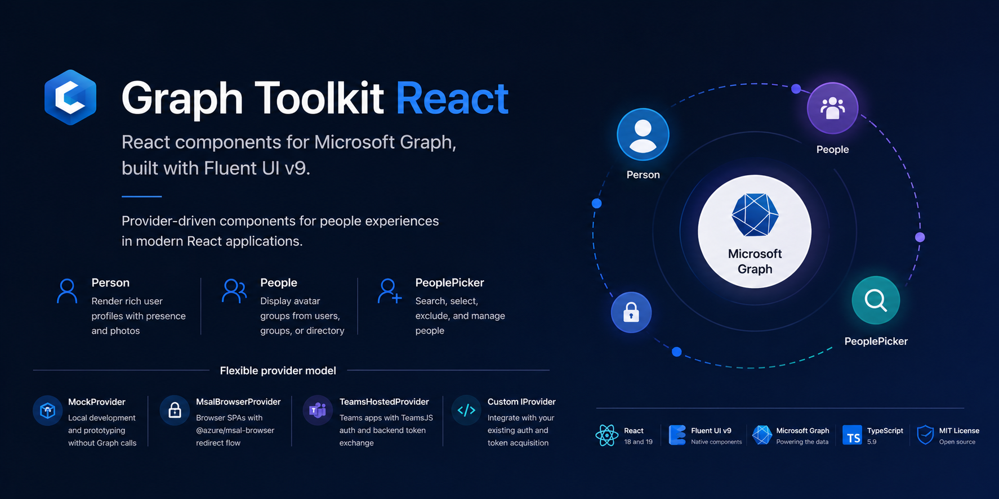
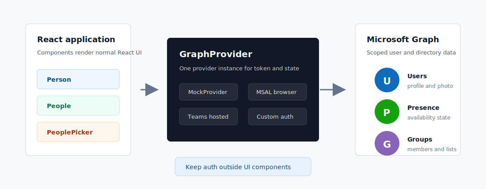

# Graph Toolkit React

React components for Microsoft Graph, built with Fluent UI v9 and a provider model that fits modern React applications.

<p>
  <a href="https://www.npmjs.com/package/@devsym/graph-toolkit-react"></a>
  <a href="https://github.com/ThomasPe/graph-toolkit-react/actions/workflows/pr.yml"></a>
  <a href="https://github.com/ThomasPe/graph-toolkit-react/actions/workflows/codeql-analysis.yml"></a>
  <a href="https://www.npmjs.com/package/@devsym/graph-toolkit-react"></a>
  <a href="./LICENSE"></a>
</p>

<p align="center">
  
</p>

## Status

Graph Toolkit React is in beta and published on the npm `beta` channel. It is ready for evaluation and early adopters, but public APIs may still change until the package exits prerelease mode and is published on the `latest` tag.

```bash
npm install @devsym/graph-toolkit-react@beta
```

This package is a React-first successor inspired by Microsoft Graph Toolkit. It uses Fluent UI v9 components directly instead of wrapping framework-agnostic web components.

## Installation

Install the package and required peer dependencies:

```bash
npm install @devsym/graph-toolkit-react@beta react react-dom @fluentui/react-components
```

Install MSAL only when you use `MsalBrowserProvider`:

```bash
npm install @azure/msal-browser
```

`@azure/msal-browser` is an optional peer dependency. Teams-hosted apps that use `TeamsHostedProvider` do not need it unless the app uses MSAL elsewhere.

## Quick Start

Use `MockProvider` for local development, demos, and Storybook-style prototyping without authentication setup.

```tsx
import { FluentProvider, webLightTheme } from '@fluentui/react-components';
import { GraphProvider, MockProvider, Person } from '@devsym/graph-toolkit-react';

const provider = new MockProvider();

export function App() {
  return (
    <FluentProvider theme={webLightTheme}>
      <GraphProvider provider={provider}>
        <Person userId="AdeleV@contoso.com" view="twolines" showPresence />
      </GraphProvider>
    </FluentProvider>
  );
}
```

For a complete browser-hosted app, try the deployed [React MSAL sample](https://gentle-beach-0f6fe2903.2.azurestaticapps.net) or review [samples/react-msal-sample/README.md](samples/react-msal-sample/README.md).

## Providers

Choose one provider and pass it to `GraphProvider`.

| Scenario | Provider | Notes |
| --- | --- | --- |
| Local development and UI prototyping | `MockProvider` | Returns deterministic mock data without Graph calls. |
| Browser-hosted React SPA | `MsalBrowserProvider` | Uses `@azure/msal-browser` redirect flow. |
| Microsoft Teams-hosted app | `TeamsHostedProvider` | Uses app-owned TeamsJS login plus a backend Graph token exchange. |
| Existing auth stack | Custom `IProvider` | Implement token acquisition and state management yourself. |

<p align="center">
  
</p>

### Browser SPA With MSAL

```tsx
import { PublicClientApplication } from '@azure/msal-browser';
import { GraphProvider, MsalBrowserProvider, Person } from '@devsym/graph-toolkit-react';

const msal = new PublicClientApplication({
  auth: {
    clientId: 'YOUR_CLIENT_ID',
    authority: 'https://login.microsoftonline.com/common',
    redirectUri: window.location.origin,
  },
});

const provider = new MsalBrowserProvider(msal, ['User.Read']);
await provider.initialize();

export function App() {
  return (
    <GraphProvider provider={provider}>
      <Person userId="me" view="threelines" />
    </GraphProvider>
  );
}
```

Register the redirect URI as a single-page application platform in Microsoft Entra ID.

### Teams-Hosted Apps

Use `TeamsHostedProvider` when a Teams app already owns TeamsJS authentication and exchanges tokens through a backend.

```tsx
import {
  createBackendTokenExchange,
  GraphProvider,
  Person,
  TeamsHostedProvider,
} from '@devsym/graph-toolkit-react';
import { authentication } from '@microsoft/teams-js';

const exchangeForGraphToken = createBackendTokenExchange({
  endpoint: '/api/token/exchange',
});

const provider = new TeamsHostedProvider({
  defaultScopes: ['User.Read'],
  getTeamsSsoToken: scopes => authentication.getAuthToken({ resources: scopes }),
  exchangeForGraphToken,
});

await provider.login();

export function App() {
  return (
    <GraphProvider provider={provider}>
      <Person userId="me" view="threelines" showPresence />
    </GraphProvider>
  );
}
```

## Components

The README keeps component examples intentionally short so it stays useful as new components are added. Explore live examples, props, and behavior in [Storybook](https://thomaspe.github.io/graph-toolkit-react/).

| Component or hook | Purpose | Where to start |
| --- | --- | --- |
| `Person` | Render a Microsoft Graph user with Fluent UI `Persona`, profile photo, presence, and configurable text lines. | Storybook examples for profile views, line rendering, direct data, and presence. |
| `People` | Render compact avatar groups from direct data, explicit user IDs, group membership, or directory defaults. | Storybook examples for avatar layouts, group lookups, direct data, and overflow behavior. |
| `PeoplePicker` | Search, select, exclude, and manage people using Fluent UI `TagPicker`. | Storybook examples for default selections, exclusions, limits, and controlled selection. |
| `usePersonData` | Resolve person data for custom UI. | Use when the built-in `Person` layout is not enough. |
| `usePeopleList` | Resolve and optionally sort a list of people. | Use when apps need to compose their own list or grid UI. |
| `usePeopleSearch` | Search users for custom picker experiences. | Use when apps need a fully custom search or picker surface. |

`Person`, `People`, and `PeoplePicker` expose `onUpdated` callbacks so apps can react to direct data changes, resolved content loads, and picker state updates with trigger metadata.

## Permissions

Request the smallest set of Microsoft Graph delegated scopes needed by the features you enable.

| Feature | Minimum delegated scope | Notes |
| --- | --- | --- |
| Current user profile, `userId="me"` | `User.Read` | Required for basic profile fields. |
| Other user profile by ID or UPN | `User.ReadBasic.All` | May require admin consent depending on tenant policy. |
| `People` default directory list | `User.ReadBasic.All` | Used when no explicit people source is provided. |
| `People` group members via `groupId` | `GroupMember.Read.All` | Required only for direct group membership lookup. |
| `PeoplePicker` focus suggestions | `User.ReadBasic.All` | Uses the initial `/users` directory list shown before typing. |
| Presence | `Presence.Read` | UI still renders without presence if unavailable. |
| Profile photo | `User.Read` | Falls back to initials if no photo is available. |

## Examples and Documentation

- [Storybook](https://thomaspe.github.io/graph-toolkit-react/) for interactive component docs.
- [samples/react-msal-sample/README.md](samples/react-msal-sample/README.md) for a browser SPA with MSAL redirect auth.
- [docs/MGT_MIGRATION.md](docs/MGT_MIGRATION.md) for migration from Microsoft Graph Toolkit.
- [AGENTS.md](AGENTS.md) for a scenario-first reference that coding agents can consume.
- [docs/COMPONENT_ROADMAP.md](docs/COMPONENT_ROADMAP.md) for planned component work.

## Support and Feedback

Use [GitHub Issues](https://github.com/ThomasPe/graph-toolkit-react/issues) for bugs, questions, and component requests. Include the package version, React version, provider type, affected component, and a minimal reproduction when possible.

## Supported Environments

| Area | Support |
| --- | --- |
| React | 18 and 19 |
| Fluent UI | `@fluentui/react-components` v9 |
| TypeScript | 5.9 |
| Development runtime | Node.js 24, matching CI |
| Package output | ESM, CommonJS, and TypeScript declarations |

## Development

```bash
npm install
npm run type-check
npm run lint
npm run test
npm run build
```

Run Storybook locally:

```bash
npm run storybook
```

Build the static Storybook site:

```bash
npm run build-storybook
```

Regenerate the README component screenshot from real Storybook renders:

```bash
npm run screenshots:readme
```

### Project Structure

```text
src/
  components/
    People/
    PeoplePicker/
    Person/
  hooks/
  providers/
  utils/
stories/
samples/react-msal-sample/
docs/
```

## Release Process

This repository uses Changesets and npm Trusted Publishing through GitHub Actions. User-facing changes should include a changeset file under `.changeset/`.

For maintainer details, see [PUBLISHING.md](PUBLISHING.md).

## Contributing

Contributions are welcome. Start with [CONTRIBUTING.md](CONTRIBUTING.md), which covers local setup, testing expectations, docs updates, and changesets.

This project follows the [Microsoft Open Source Code of Conduct](CODE_OF_CONDUCT.md).

## License

MIT. See [LICENSE](LICENSE) for details.

## Acknowledgments

- [Fluent UI](https://react.fluentui.dev/) for the React component system.
- [Microsoft Graph](https://graph.microsoft.com) for the API surface behind the components.
- The Microsoft Graph Toolkit community for the original component patterns that inspired this React-first package.
